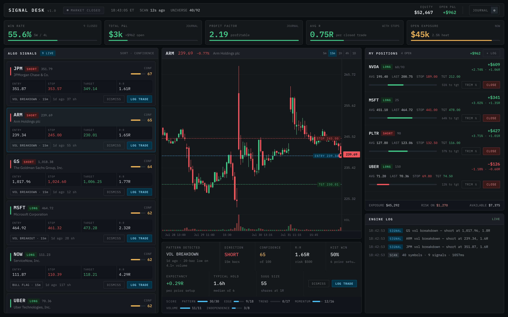

# LP Stock Signals — Signal Desk

A technical-analysis signal desk. It scans the market for chart patterns,
scores each one against the surrounding market context, and tracks the real
trades you take on them.



Three panels, left to right: signals the engine found, a chart of the selected
one with its levels drawn on, and a journal of your open positions. The
screenshot runs on live market data; the journal is seeded with sample trades
to show the statistics populated.

## What it actually does

**Finds patterns.** Nine detectors — bull/bear flag, cup and handle, double
top/bottom, ascending/descending triangle, volume breakout/breakdown, and
engulfing reversals — run over live OHLCV bars at five timeframes.

**Then argues with them.** A pattern on its own is not a trade. Each candidate
is scored out of 100 across six factors, and the breakdown is shown under the
chart so you can see exactly where the number came from:

| Factor | Max | What it asks |
| --- | --- | --- |
| `PATTERN` | 30 | How cleanly does the geometry actually fit? |
| `EDGE` | 18 | Has this pattern made money on this symbol before? |
| `TREND` | 17 | Does ADX/±DI agree with the direction? |
| `MOMENTUM` | 16 | Is MACD aligned, and does RSI leave room to run? |
| `VOLUME` | 11 | Is anyone actually trading it? |
| `INDEPENDENCE` | 8 | Or is this just SPY wearing a ticker? |

Signals below 55 are dropped, as are those with reward-to-risk under 1.5, an
RSI already extended against the trade, or ±DI pointing firmly the other way.

**Measures its own edge.** `EDGE` is not a guess. For each candidate the
detector is replayed across that symbol's own history, and every past
occurrence is scored against the entry, stop and target the live engine would
have produced. A pattern measured to lose more than 0.35R per attempt over ten
or more setups is vetoed outright, regardless of how good the chart looks.

The backtest is deliberately pessimistic: each historical window is a strict
prefix of the series so detectors never see the future, and when a single bar
spans both stop and target the stop is assumed to have hit first, since
intrabar order is unknowable from OHLC.

**Says when you can't act on it.** A signal found after the bell is still a
signal, but it is not a trade you can take, so every card carries a notifier
while the exchange is shut: how long until the open, and what that means for
this particular setup. If price has already reached the trigger the entry is a
fill on the open and the gap decides it; if the trigger is still out ahead, a
resting order placed tonight works the next session on its own. The countdown
runs off a real session calendar — weekends, holidays, and the 13:00 half-days
— so it does not promise you an open on Thanksgiving.

**Journals your real trades.** `LOG TRADE` pre-fills a ticket from the signal,
but every field stays editable — the price you got is rarely the price on
screen, and a journal that records the plan instead of the fill would corrupt
every statistic built on it. Positions are marked to market against live
quotes, partial exits are first-class, and win rate, profit factor and average
R across the top are computed from your closed trades only.

Nothing here places orders. It is a journal, not a broker.

## Running it

```bash
npm install
npm run dev
```

Then open <http://localhost:3000>. No API keys and no signup — market data
comes from Yahoo Finance's public chart endpoints.

```bash
npm test          # 90 unit tests, no network required
npm run build     # production build
npm run lint
```

## How it's put together

Next.js 16 with the App Router, React 19, TypeScript and Tailwind v4. The
signal engine is TypeScript running server-side in route handlers — one repo,
one deploy, no separate service.

```
src/
  app/api/
    scan/          sweep a slice of the universe for signals
    candles/       bars for one symbol and timeframe
    quotes/        last prices, for marking positions
  lib/
    market/        Yahoo client, caching, the scan universe, session calendar
    analysis/      indicators, pattern detectors, backtest
    signals/       scoring engine and shared level construction
    journal/       trade model, statistics, persistence
  components/      the desk and its panels
config/            eslint
```

A few things worth knowing if you work on it:

**`buildLevels` is shared on purpose.** The live engine and the backtest both
turn a pattern into entry/stop/target through the same function. If they ever
diverged, the historical win rate on a card would describe a different trade
than the one being offered.

**Indicators return `NaN` during warm-up**, aligned to the input array, so a
half-warmed reading can never masquerade as a real one. They were verified
against the `technicalindicators` reference library on live data.

**The Yahoo client is defensive for a reason.** Its public endpoints throttle
hard, and two behaviours are easy to trip over: a full desktop-browser
user-agent gets 429'd (it routes to a path expecting a session cookie and
crumb, so the client sends a deliberately minimal one), and at session
boundaries Yahoo appends a synthetic bar carrying the current price in all four
OHLC fields with zero volume. That bar is stripped — left in, it drove every
relative-volume reading to zero.

**The scan universe is curated, not exhaustive.** Around 90 liquid US names and
sector ETFs, swept 40 at a time, because every symbol is an upstream request.
Scans rotate through the list; "SCAN NEXT BATCH" advances to the next slice.

**The holiday table needs extending each year.** `market/session.ts` hard-codes
closures and half-days through 2027, because the observance rules are only
simple until Good Friday and a Saturday Christmas get involved. Past the last
date covered it degrades to plain weekday rules rather than failing, so the
symptom of a stale table is a notifier cheerfully counting down to an open on
Thanksgiving.

**Your journal lives in this browser's localStorage.** There is no account and
no server-side storage, so the export file is the only backup that exists —
it's in the ⚙ menu, along with import.

## Limitations

- Data is Yahoo's public feed: delayed, unofficial, and rate-limited. Fine for
  analysis, not for execution.
- Backtests run on 400 bars per symbol. Samples are small, and a win rate over
  five or six setups is indicative at best — that's why expectancy is shown
  next to it and why thin samples get partial credit rather than the benefit of
  the doubt.
- Signals are pattern-matching on price and volume. They know nothing about
  earnings, news, or anything fundamental.

## License

MIT
